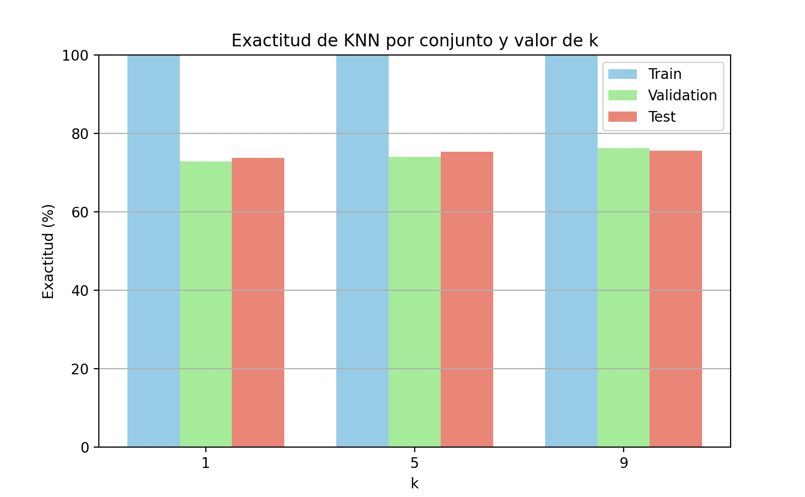

# README.md

  

## Descripción

Este proyecto implementa el algoritmo **K-Nearest Neighbors (KNN)** en dos versiones:

1.  **Implementación manual (sin frameworks de ML)** → cálculo de distancias, selección de vecinos y votación por mayoría programados desde cero.

2.  **Implementación con framework (scikit-learn)** → usando `KNeighborsClassifier` para simplificar y mejorar la presentación de resultados.

  

El objetivo es **clasificar la calidad del vino tinto** en dos categorías:

-  **Bueno** si la calidad (columna `quality`) es mayor o igual a 6.

-  **Malo** si la calidad es menor a 6.

  

## Dataset

Se utiliza el dataset **Wine Quality (Red Wine)** disponible en o en [Kaggle](https://www.kaggle.com/datasets/uciml/red-wine-quality-cortez-et-al-2009).

  

Archivo esperado:

```

winequality-red.csv

```

  

Este dataset contiene 11 características fisicoquímicas del vino (pH, acidez, alcohol, etc.) y una etiqueta `quality` (entero de 0 a 10).

  

## Requisitos

- Python 3.8 o superior

- Librerías necesarias:

```bash

pip install pandas scikit-learn matplotlib

```

  

> La versión **sin framework** no requiere instalar librerías externas, solo Python estándar.

  

## Ejecución

  

### 1. Implementación manual (sin framework)

Archivo: `KNN.py`

Ejecutar en consola:

```bash

python3 KNN.py

```

  

Salida esperada:

- Lista de predicciones **Real vs Predicho**

- Resumen de exactitudes por cada `k` (ejemplo):

```

===== Resumen de exactitudes por k =====

k=3 -> Exactitud: 72.18%

k=5 -> Exactitud: 73.04%

k=7 -> Exactitud: 71.45%

```

  

### 2. Implementación con framework (scikit-learn)

Archivo: `knn_framework.py`

Ejecutar en consola:

```bash

python  knn_framework.py

```

  

Salida esperada:

- Reporte de clasificación para cada `k` (precisión, recall, F1).

- Tabla comparativa de exactitudes:

```

k Exactitud (%)

3 72.18

5 73.04

7 71.45

```

-  **Gráfica de barras** mostrando la exactitud de cada `k`.

- 

  

## Ejemplo de salida gráfica

Exactitud de KNN según el valor de `k`:

  



  

---